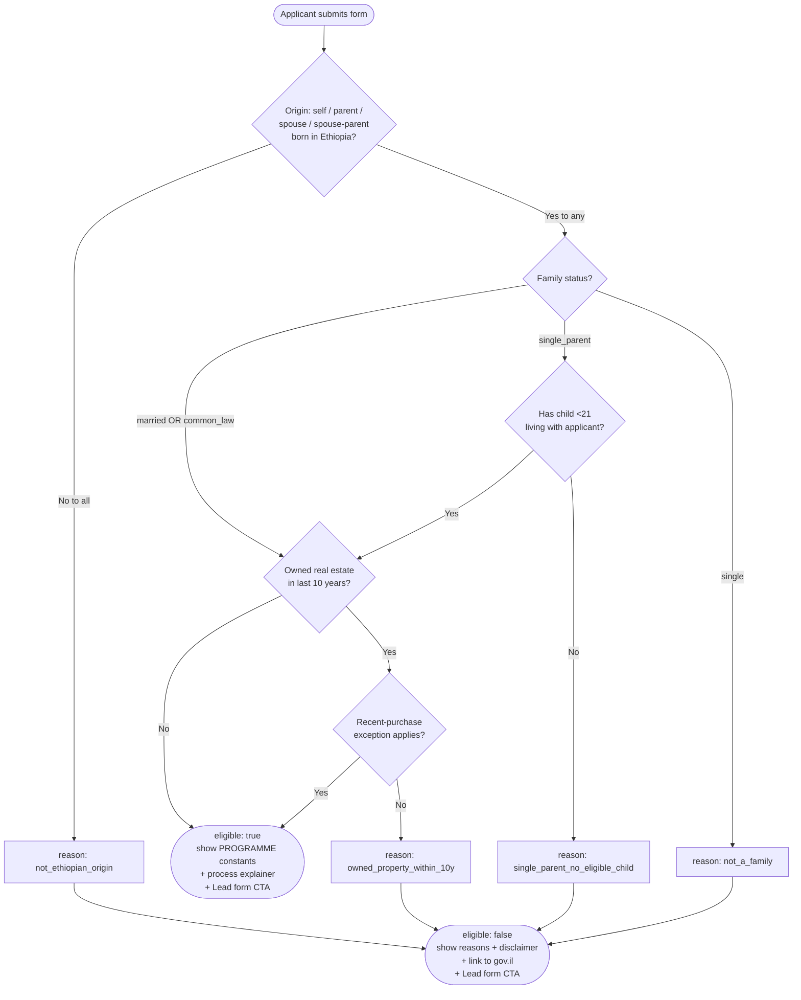

# ADR-009: Mortgage eligibility for Ethiopian olim — binary model, no fabricated parameters

**Status**: Accepted (2026-04-27).
**Owner**: Tedros Architect.
**Supersedes**: The MVP heuristic eligibility surface in PR [#3](https://github.com/Orhgit/tedros/pull/3) (`app/lib/mortgage/eligibility.ts`).
**Related**: [TED-23](mention://issue/a0122b57-bb03-4e03-8d2b-a2aeef6e1604) (this ADR), [TED-16](mention://issue/20423579-a41b-4828-9239-da22a8a6cd53) (parent — MVP shipped with disclaimer), [TED-21](https://multica.ai) (Lead form), PR [#7](https://github.com/Orhgit/tedros/pull/7) (verified-research source-of-truth: `docs/research/mortgage-program-verified.md`).

## Context

The Phase 3.1 MVP shipped a calculator for the _הלוואת המדינה ליוצאי אתיופיה_ programme (`/calculator/mortgage-ethiopian-immigrants`) with an explicit disclaimer that the eligibility surface was an indicative heuristic, not the official programme. Tedros Researcher has now verified the official programme parameters against gov.il, kol-zchut, Calcalist, Bizportal, Globes, and Knesset MMM (see PR #7 — `docs/research/mortgage-program-verified.md`). Two facts emerge from that research:

1. **The programme is binary, not graded.** Every approved family receives the same loan: ₪600,000, 25 years, 0% for the first 10 years, 2% for the next 15. There are no tiers, no per-child top-ups, no graded grants, no income ceiling, no minimum age. Gating is done by an annual quota of ~200 families and a lottery, not by a means test.
2. **Every parameter currently in `eligibility.ts` that _grades_ an applicant is fabricated.** `MIN_AGE = 21`, `INCOME_CEILING_HEURISTIC = 35_000`, `tier`/`baseByTier`/`grantByTier`, `perChild = 25_000`, the sliding `subsidyRate`, `subsidisedRateAnnual`/`marketRateAnnual` — none are sourced. Some are actively wrong (the official programme has no age minimum; the official rate schedule is two-phase 0%/2%, not flat subsidised/market).

Keeping these heuristics on a public, SEO-indexed page that targets a vulnerable population (olim and second-generation Ethiopian-Israeli families with limited financial-product literacy) is a concrete harm: the user trusts numbers we made up, then gets a different answer from the bank. The MVP disclaimer is necessary but not sufficient cover. Phase 3.1.1 must remove the fabricated grading and surface only what the official programme actually decides: **eligible / not eligible, plus the reasons.**

## Decision

**The eligibility surface becomes a binary check** — `eligible: true` or `eligible: false` with a typed `reasons[]` — with **no per-applicant numeric estimates**. The loan amount, term, and rate schedule are programme constants and shown the same way to every eligible applicant.

### D1. Output shape

```ts
// app/lib/mortgage/eligibility.ts (new shape — replaces tiered model)

export const PROGRAMME = {
  loanAmount: 600_000,
  termYears: 25,
  phase1: { years: 10, rateAnnual: 0 },
  phase2: { years: 15, rateAnnual: 0.02 },
  equityRatioAtMaxLoan: 0.05, // when full ₪600K is used
  equityRatioAboveMaxLoan: 0.25, // when borrowing more on top
  annualLotteryQuota: 200, // soft figure, displayed with "approx."
} as const;

export type IneligibilityReason =
  | "not_ethiopian_origin"
  | "not_a_family" // single, no eligible child
  | "single_parent_no_eligible_child"
  | "owned_property_within_10y";

export type EligibilityResult =
  | { eligible: true } // amount/term/rate come from PROGRAMME constants
  | { eligible: false; reasons: IneligibilityReason[] };
```

There is no `loanAmount`, `grantAmount`, `tier`, `phase1RateAnnual`, etc., on the `eligible: true` branch. All of those are properties of the _programme_, not of the _applicant_; they live as `PROGRAMME` constants and are rendered the same way for everyone who passes. This is a deliberate inversion of the MVP shape — the result no longer pretends to be personalized.

### D2. Input shape — binary questions, not numeric inputs

The form drops `age`, `monthlyIncome`, and `children: number` from the eligibility input. It keeps only what the official programme actually checks:

```ts
export const eligibilityInputSchema = z.object({
  // Origin (Ethiopian descent — one path of four suffices):
  selfBornInEthiopia: z.boolean(),
  parentBornInEthiopia: z.boolean(),
  spouseBornInEthiopia: z.boolean(),
  spouseParentBornInEthiopia: z.boolean(),
  // Family status:
  familyStatus: z.enum(["married", "common_law", "single_parent", "single"]),
  hasChildUnder21LivingWithApplicant: z.boolean(),
  // No-prior-ownership:
  ownedRealEstateLast10Years: z.boolean(),
  recentPurchaseExceptionApplies: z.boolean(), // documented exception, see #7 in research doc
});
```

`monthlyIncome` does **not** belong on this form. It does not affect eligibility for this programme. (If Brokerage wants it for follow-up qualification, see D5.)

### D3. Decision tree



Multiple reasons may accumulate (e.g. `not_ethiopian_origin` + `owned_property_within_10y`). The function returns _all_ applicable reasons rather than short-circuiting on the first one — users deserve the full picture in one pass, not three rounds of "fix this, now fix that."

### D4. `reasons[]` is the i18n contract

`IneligibilityReason` is a stable enum of message keys, not user-facing strings. Translations live in Paraglide messages keyed by reason:

| Reason key                        | HE message                                                                    | EN message                                                                                   | AM message                                                                       |
| --------------------------------- | ----------------------------------------------------------------------------- | -------------------------------------------------------------------------------------------- | -------------------------------------------------------------------------------- |
| `not_ethiopian_origin`            | התוכנית מיועדת למי שנולד באתיופיה או שאחד מהוריו / מבני זוגו נולד באתיופיה.   | This programme is for applicants born in Ethiopia, or whose parent or spouse was born there. | ይህ ፕሮግራም ለሚገኙ ሰዎች የሚውል ነው — በኢትዮጵያ የተወለዱ፣ ወይም ወላጅ ወይም የትዳር አጋር በኢትዮጵያ የተወለደ ለሆኑ። |
| `not_a_family`                    | התוכנית מיועדת למשפחות (נשואים / ידועים בציבור / הורה יחיד עם ילד מתחת ל-21). | This programme is for families (married, common-law, or single-parent with a child <21).     | ይህ ፕሮግራም ለቤተሰቦች የሚውል ነው (ያገቡ፣ የተወዳጁ፣ ወይም ከ21 ዓመት በታች ልጅ ያላቸው ብቸኛ ወላጆች)።          |
| `single_parent_no_eligible_child` | הורה יחיד זכאי רק אם יש ילד מתחת לגיל 21 שגר איתו.                            | Single parents qualify only when a child under 21 lives with the applicant.                  | ብቸኛ ወላጆች በተግባር ብቁ የሚሆኑት ከ21 ዓመት በታች ልጅ ከእነሱ ጋር በሚኖርበት ጊዜ ብቻ ነው።                  |
| `owned_property_within_10y`       | התוכנית דורשת שלא הייתה לך בעלות בנכס נדל"ן ב-10 השנים האחרונות (יש חריגים).  | The programme requires no real-estate ownership in the past 10 years (exceptions apply).     | ፕሮግራሙ በመጨረሻዎቹ 10 ዓመታት የንብረት ባለቤትነት እንዳልነበረ ይጠይቃል (ልዩ ሁኔታዎች አሉ)።                  |

Content & SEO owns the final wording; the **keys are frozen** by this ADR so Engineer can wire them, Data & Integrations can log them in `lead_events`, and translations don't drift across files. The Amharic strings above are placeholders — Content & SEO must validate with a native speaker before ship.

### D5. `monthlyIncome` — removed from the eligibility input, optional on the Lead form

**Eligibility input does not contain `monthlyIncome`.** It is not a programme criterion. Asking for it on the eligibility form would (a) imply it gates eligibility, which is false and harmful, and (b) inflate form abandonment.

The Lead form (TED-21) MAY collect monthly income as a _separate, clearly-optional_ field labelled _"For follow-up by a mortgage advisor — does not affect your eligibility above."_ That field belongs to the brokerage's downstream workflow, not to programme eligibility, and the data flows into the leads pipeline (Data & Integrations to wire). It must never round-trip back into the eligibility check.

### D6. Programme-availability disclaimer — code-enforced

The Researcher could not verify (HTTP 403 from gov.il endpoints to automated agents) that the programme has an active 2026 lottery cycle. Until a human confirms current cycle status, the eligibility result page MUST render a code-level disclaimer, regardless of result:

> _"הגרלות מתפרסמות מעת לעת באתר משרד הבינוי והשיכון. בדקו זמינות הגרלה פעילה לפני הרשמה."_ + a direct link to `https://www.gov.il/he/departments/topics/mortgage_assistance_new_immigrant/govil-landing-page`.

Engineer to render this from a `mortgage_disclaimer_active_lottery` Paraglide key (HE/EN/AM). It is **not** dismissible.

### D7. What stays / what goes from PR #3

**Goes (delete):**

- `MIN_AGE`, `INCOME_CEILING_HEURISTIC`
- `classifyTier()` and the `tier` discriminator
- `baseByTier`, `grantByTier`, `perChild`
- `subsidisedRateAnnual` / `marketRateAnnual` constants and any UI that displays a "subsidised vs. market" comparison
- `loanAmount` / `grantAmount` from the result type
- The `age` and `monthlyIncome` form fields
- All tests asserting tier classification, per-child top-up, or income ceiling

**Stays:**

- `MAX_LOAN = 600_000` — promoted into the `PROGRAMME` constant block
- The two-phase rate schedule (0% / 10y, 2% / 15y) — promoted into `PROGRAMME`
- The disclaimer copy infrastructure (Paraglide keys), expanded per D6
- The route at `app/routes/$lang.calculator.mortgage-ethiopian-immigrants.tsx` — rewritten, not relocated
- The `parseEligibilityForm()` adapter pattern (validate at the boundary), updated for the new schema

## Consequences

### Code-level

- `app/lib/mortgage/eligibility.ts` is rewritten end-to-end. The public surface (`PROGRAMME`, `IneligibilityReason`, `EligibilityResult`, `eligibilityInputSchema`, `parseEligibilityForm`, `calculateEligibility`) is the new contract — Engineer treats anything outside this surface as private.
- `app/routes/$lang.calculator.mortgage-ethiopian-immigrants.tsx` becomes a 5–7 binary-question form (D2) → result panel (eligible OR reasons[]) → static "how it works" panel (4 steps: register → certificate → lottery → 4-month window) → Lead-form CTA. No numeric output. No sliders. No income input.
- A `<ProgrammeFactsCard />` component renders `PROGRAMME` constants identically for every eligible applicant. Same component, same numbers — no per-user math.
- The disclaimer in D6 is rendered unconditionally on the result page. Engineer wires it from Paraglide; not dismissible.

### Data model

- **No DB schema change** for eligibility itself — the check is stateless.
- The Lead form pipeline (TED-21, Data & Integrations) MUST persist `eligibility_outcome: "eligible" | "ineligible"` and `eligibility_reasons: text[]` (Postgres `text[]`, values from the `IneligibilityReason` enum) on each lead row, so brokerage can prioritize follow-ups and we can measure ineligibility-reason distribution. Optional `self_reported_monthly_income: numeric(10,2)` separately, nullable, never used to recompute eligibility.

### i18n

- All four `IneligibilityReason` keys map to one Paraglide message key each: `mortgage_eligibility_reason_<key>`. Plus `mortgage_disclaimer_active_lottery`. Plus a `mortgage_eligibility_eligible_summary` key for the eligible state.
- HE/EN/AM coverage is required at Engineer's PR open — no `// TODO translate` placeholders. Content & SEO confirms the AM strings with a native speaker before merge (the table in D4 is a starting draft, not a sign-off).
- RTL/LTR: identical layout in HE (rtl) and EN/AM (ltr) per ADR-008. Use logical properties (`ms-*`/`me-*`) — no `dir`-keyed branches.

### SEO / Content

- The H1, meta description, FAQ, and JSON-LD schema (already shipped per commit `92c6e56`) need a copy pass to drop tier/grant language and reflect the binary model. Content & SEO owns; Engineer applies.
- The mortgage page title does **not** change (still indexed). The body copy and FAQ change.

### Test/QA

- Drop all unit tests asserting tiered output. New tests:
  1. Each `IneligibilityReason` is reachable from at least one input combination.
  2. Multiple-reason accumulation: an applicant who fails origin AND ownership returns both keys, in the canonical order defined by the enum.
  3. Eligible result returns no per-applicant numeric fields (type-level assertion + runtime check).
  4. `PROGRAMME` constants are frozen (`Object.isFrozen` true).
  5. Form-parse rejects `age`, `monthlyIncome`, and any other extraneous numeric field with a clear error (defensive — they shouldn't be sent at all).
- QA's accessibility pass must verify the result page reads correctly under a screen reader for both eligible and not-eligible states in HE/EN/AM. Reasons are content, not decorative — `aria-live="polite"` on the reasons region.

### Risk register

- **Removed risk**: "users trust our fabricated tier numbers and get burned at the bank." This was real and is now closed by D1.
- **New risk** (low, time-bound): the programme may not have an active 2026 lottery. Mitigated by D6's mandatory disclaimer + gov.il link until human verification lands. This ADR does **not** block ship on that verification — the disclaimer covers the gap.

### Documentation

- This ADR + `docs/research/mortgage-program-verified.md` (PR #7) together are the source-of-truth for the programme. Any future code change to `eligibility.ts` that diverges from either MUST come with an updated ADR and an updated source row in the research doc.

## Alternatives Considered

### A. Keep the tiered MVP and just hide it behind a stronger disclaimer

Rejected. The MVP disclaimer was the right move at MVP-ship gate (TED-16) when the calculator's value was "do something useful while research catches up." Now that research has caught up, continuing to show fabricated numbers is no longer a tradeoff between _useful_ and _exact_ — it's a tradeoff between _deceptive_ and _honest_. We pick honest. Keeping made-up tiers also makes the page less trustworthy for SEO/EEAT signals (Google's helpful-content guidance treats fabricated specifics as a quality penalty).

### B. Estimate likelihood of being drawn in the lottery (e.g. 200/N applicants)

Rejected for now. Applicant-pool size for any given cycle is not published; estimating "your odds are ~X%" would be a new fabricated number replacing the one we just removed. Static "approximately 200 families per year, by lottery" is honest and avoids implying personal odds.

### C. Show an interactive "what-if-I-borrow-more-than-600K" estimator (extra equity)

Rejected from this scope. The programme itself is binary; the cross-product with a market mortgage is a separate calculator (Phase 4 candidate). Mixing them in this surface re-introduces the same problem: per-applicant numbers that bleed credibility from the programme surface.

### D. Suggest an alternative path ("הלוואת זכאות רגילה לזוגות צעירים") to ineligible applicants

**Deferred** — not rejected outright, but out of scope for TED-23. Adding a parallel programme requires its own research-grade verification pass and its own eligibility model. Routing ineligible users to an under-researched second programme would re-introduce the harm we just removed. PM to decide whether to scope this as TED-23.x or a fresh ticket; until then, ineligible users see the disclaimer + Lead form CTA + gov.il link.

---

**Next agents:** Tedros Engineer for the `eligibility.ts` + route rewrite per D1–D7. Tedros Data & Integrations for the Lead form `eligibility_outcome` / `eligibility_reasons` / optional `self_reported_monthly_income` columns per D5 and the "Data model" section.
