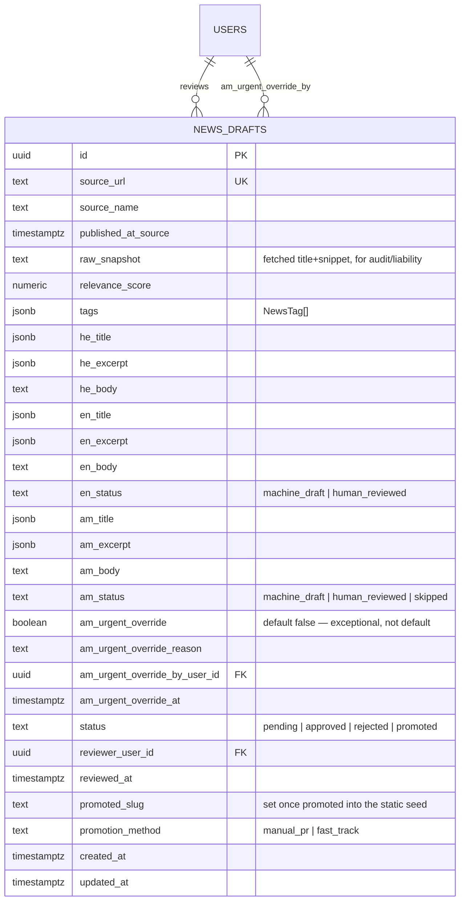
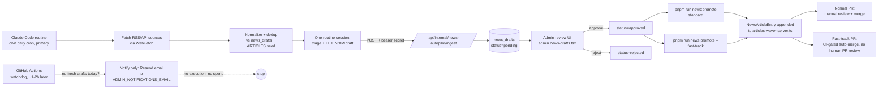

# ADR-016: News autopilot — collection, AI drafting, and human-approval pipeline

**Status**: Accepted (2026-08-24). **Amended 2026-08-24 (×2)** — see [Amendment 1](#amendment-1-2026-08-24--owner-approved-subscription-runtime-am-urgent-override-fast-track-promotion) (subscription-based runtime, AM urgent-override, fast-track promotion) and [Amendment 2](#amendment-2-2026-08-24--owner-approved-no-paid-fallback-am-override-rate-limit) (no paid fallback under any circumstance; AM urgent-override capped at ~2/week) below.
**Owner**: Tedros Architect (this decision); Tedros Engineer (route + pipeline code); Tedros Data & Integrations (`news_drafts` schema + migration); Tedros Content & SEO (draft review + promotion).
**Related**: TED-114 (Linear), [ADR-015 careers-hub-foundation](./015-careers-hub-foundation.md) (static-vs-DB boundary rule this ADR applies), `docs/agents/09-devops.md` (autopilot roster), `docs/discovery/0.2-execution-plan.md:88,300` (urban-renewal news autopilot planned), `docs/discovery/risk-register.md` R3/R12/R14/R18/R20/R21 (Amharic quality, content liability, stale gov content, politicization, subscription-runtime trade-off, fast-track promotion).

## Context

The News vertical (`app/lib/news/`) ships today as a hand-authored static seed: `NewsArticleEntry[]` split across `articles.server.ts`, `articles-wave4.server.ts`, `articles-wave5.server.ts`. Each entry has `slug`, `title`/`excerpt` (`Translatable`), `publishedAt`/`updatedAt`, `tags: NewsTag[]`, and `bodies: Record<Locale, string>` (HE/EN/AM markdown, HE authored first per CLAUDE.md, EN/AM mirrored). `schema.ts` generates `NewsArticle` JSON-LD (Google Top Stories eligible) per entry. This is fine for evergreen explainers but cannot track daily-moving topics — urban renewal (התחדשות עירונית), rights changes, community events — which is exactly what TED-114 asks for.

Constraints going in:

- **Cost discipline (CLAUDE.md)** — no monthly SaaS budget; free tiers and self-hosted preferred. `ANTHROPIC_API_KEY` is already provisioned in `app/lib/env.server.ts` (used today for the Mula chatbot) and `@anthropic-ai/sdk` is already a dependency — reusing both avoids new integration surface, but Claude API usage is pay-per-token, not literally free (see Cost, below — this is the one line item that needs explicit owner sign-off).
- **Existing infra** — `docker-compose.prod.yml` runs `postgres` + `redis` + `tedros` (Node/RR7) on a single dedicated server, app bound to `127.0.0.1:3001` behind Nginx. Postgres is **not** network-reachable from outside the host — no external job can write to it directly.
- **i18n (ADR-004/CLAUDE.md)** — HE is source-of-truth; EN mirrors; AM requires human review per risk R3 ("Quality Amharic translation is rare/expensive... in-community human translator; verify... early").
- **Static-vs-DB boundary (ADR-015)** — every vertical shipped after Rights Hub uses a static seed; the DB is reserved for entities with a genuine external write path (moderation, leads, subscribers). A daily autopilot **is** an external writer, which is the first time the News vertical crosses that boundary — but only for the draft/review queue, not necessarily for publish.
- **A pre-existing but unused DB scaffold** — `app/lib/db/schema/content.ts` already defines `articles` + `article_translations` (generic CMS-shaped: title/slug/excerpt, `authorUserId`, `tags`, `publishedAt`, soft-delete) and `programmatic_pages`. Neither is wired to any loader yet. It's tempting to reuse `articles` for autopilot drafts instead of adding a new table.
- **RBAC (ADR-003)** — `userRoleEnum` is `user | agency_member | agency_admin | admin`. `requireRole()` in `app/lib/auth/guards.ts` is shape-correct but the actual `users.role` lookup is a documented TODO ("wired once Data lands the schema") — this ADR's admin-approval surface depends on that lookup actually being wired, which is a prerequisite, not a new risk this ADR introduces.

## Decision

### 1. Runtime: a Claude Code **cloud routine** does the fetch+classify+draft work under the owner's existing subscription; GitHub Actions stays as the orchestration/fallback layer — not host cron, not the Multica autopilot scheduler

**Amendment 1 (owner-approved, 2026-08-24)**: replace the pay-per-token `ANTHROPIC_API_KEY` calls as the *primary* mechanism with a Claude Code **routine** (`claude.ai/code/routines` — created via the `RemoteTrigger` API / the `schedule` skill) running under the owner's existing Claude Code/claude.ai Pro or Max subscription, to eliminate the recurring ~$6–12/month API line item in the common case. This is not a drop-in "run the same code for free" swap — see the trade-offs below, which is why the pay-per-token path stays wired as an automatic fallback rather than being deleted.

**How a routine actually works, and why that shapes the design** (verified against the `schedule` skill / `RemoteTrigger` API, not assumed):

- A routine is a **fully isolated cloud session** — its own git checkout of the `tedros` repo, its own sandboxed tools (Bash, WebFetch, Read, Grep, …), scheduled by a server-side cron (`cron_expression`, **minimum interval 1 hour** — irrelevant here since this job is daily). It is **not** a process on the prod box.
- Critically: **a routine cannot access local files, local services, or local environment variables on the prod server.** It has no path to `127.0.0.1:5432` (Postgres is not network-reachable outside the host — see Context). So a routine cannot write to the production DB directly, the same constraint that ruled out a bare GitHub Actions runner in the original design.
- The fix is the same one already in this ADR: the routine does the **reasoning** (fetch RSS via `WebFetch`, normalize, do the relevance-triage + HE/EN/AM drafting itself, as one agentic session rather than two separate API tiers), then makes an **outbound HTTPS call** to the same authenticated internal route this ADR already specified — `POST /api/internal/news-autopilot/ingest` (renamed from `/run`; same `AUTOPILOT_SECRET` bearer-token gate) — which persists the result into `news_drafts` exactly as before. **The DB write path does not change** — only what produces the payload changes, from "Node process calling the Anthropic SDK" to "cloud routine calling the app's own API."

**GitHub Actions' role, per Amendment 2, is watchdog-and-notify only — never an execution fallback.** `news-autopilot.yml` runs ~1–2h *after* the routine's own daily schedule and checks (via a lightweight status query on the internal route) whether fresh `news_drafts` rows landed today. If not, it sends a **notification, and does nothing else** — see the Amendment 2 note below for why the original design's paid fallback was removed entirely, not just deprioritized.

**Explicitly rejected variant: a headless CLI (`claude -p`) with a persisted personal login on the prod server.** This was considered (it's technically capable of shelling out to `psql` directly, since it runs on the box) but rejected: it requires storing a long-lived personal OAuth session inside a shared production Docker container (a real credential-exposure surface), and it's a less-documented usage pattern than routines, which are Anthropic's own first-party product for exactly this "scheduled cloud agent" use case. Routines are the supported mechanism; a locally-persisted CLI login is a workaround.

**The trade-off, stated plainly (per owner's request — this is not a magic free solution):**

- **Shared usage pool, not a separate meter.** Routine runs draw from the same Pro/Max subscription usage allowance the owner's own interactive Claude Code/claude.ai sessions use — there is no documented separate "automation quota." Expected daily volume here is small (a handful of relevant items, one classify+draft session), but it is a real, shared, less-visible budget, not literally free. A burst in source volume, or a stuck/looping routine, could measurably eat into the pool on a given day and compete with the owner's own interactive usage that day.
- **Cost shifts from a metered dollar amount to a shared capacity budget — and per Amendment 2, that's the *only* cost there is.** There is no paid fallback of any kind (see below): the trade is entirely in availability, never in an unexpected bill.
- **This needs a monitoring signal, since there's no fallback to quietly absorb a failure.** Silent quota exhaustion would otherwise mean the feed goes stale with nobody noticing — the GH Actions watchdog run (above) is the *only* safety net in this design: it turns "routine quietly stopped working" into a visible signal, nothing more.

**Amendment 2 (owner-approved, 2026-08-24) — no paid fallback, under any circumstance.** The owner was explicit: "לא רוצה לשלם תוספת כסף" (don't want to pay anything extra). Amendment 1's original design kept the pay-per-token Haiku/Sonnet path wired as an automatic fallback the watchdog could invoke; that fallback is **removed entirely**, not merely deprioritized — there is no code path in this design that spends money automatically, or at all, under any failure mode. In its place: the GH Actions watchdog's only action on a missed day is a **notification**, reusing the Resend adapter already provisioned in this codebase (`RESEND_API_KEY`/`RESEND_FROM` in `app/lib/env.server.ts`, TED-22) and the `ADMIN_NOTIFICATIONS_EMAIL` address already used for other admin alerts — no new integration, no new secret. This makes the cost ceiling **exactly $0/month**, not a worst-case dollar figure (see Cost). The consequence, accepted explicitly by the owner, is that a routine outage means a real gap — zero new drafts that day — rather than degraded-but-continuous service; see Consequences and Open Questions.

**Why not the Multica autopilot scheduler**, even though `docs/agents/09-devops.md` lists "urban-renewal news (יומי)" as a Multica autopilot and `0.2-execution-plan.md` mentions it as planned:

- Multica is the **team's coordination/agent-orchestration tool** — its autopilots are designed for agent-run maintenance tasks (broken-link sweeps, ranking reports) that read the live site and report back, not for a job that must authenticate against a production database and write user-facing content on a guaranteed daily cadence.
- Coupling News-feed freshness to Multica's uptime/SLA (a dev-tooling dependency) is a worse failure mode than coupling it to GitHub Actions (already product-critical for CI/CD) or to Claude Code routines (a supported scheduling product with its own dashboard/run history).
- No published pricing/rate-limit model for Multica running daily production workloads — same "no surprise cost" concern that motivated the entire subscription-runtime amendment.
- **Compromise, not exclusion**: once a draft is written, the pipeline can optionally ping the DevOps/Content&SEO agents via Multica ("N new drafts pending review") as a best-effort notification — non-critical, doesn't gate correctness if it fails.

### 2. Collection stage: RSS/API fetch → normalize

New module `app/lib/news/autopilot/sources.server.ts` — a typed array of sources (RSS first; source-specific API adapters added only if a source has no feed):

| Source type | Examples | Why |
|---|---|---|
| Government RSS | gov.il press releases (Ministry of Welfare, Ministry of Housing/רמ"י, Ministry of Aliyah and Integration) | Primary-source, matches R14's govt-program-change mitigation |
| Knesset RSS | Committee announcements touching housing/rights/immigration | Same |
| NGO/anchor blogs | ENP, Tene Briut, Tebeka (if they publish a feed) | Community-relevant by construction; reinforces the anchor-partnership content strategy (ADR-011) |
| News-outlet tag feeds | Ynet/Haaretz/N12 RSS filtered by keyword (יוצאי אתיופיה, התחדשות עירונית, קהילה) | Broader net; needs the strongest relevance filter (stage 3) |

Normalization output (not persisted yet — ephemeral, in-memory for the run):

```ts
interface RawNewsItem {
  sourceUrl: string;
  sourceName: string;
  title: string;
  snippet: string;
  publishedAtSource: string; // ISO, from feed
  fetchedAt: string;
}
```

Dedup against both `news_drafts.sourceUrl` (any status) and the static `ARTICLES` seeds' `sourceUrl` metadata (added in §5) before spending any AI tokens.

### 3. Classification/processing stage — the routine's own session, and only the routine's own session

**Amendment 2 (owner-approved, 2026-08-24): the two-tier pay-per-token fallback described in Amendment 1 (Haiku triage → Sonnet draft, invoked automatically on a missed day) is removed entirely, not deprioritized.** The owner was explicit that no paid alternative execution is acceptable under any circumstance (§1). The result is a single execution path, full stop: the Claude Code routine from §1. Given the normalized+deduped items (fetched via its own `WebFetch` calls), the routine's single agentic session performs relevance triage and HE/EN/AM drafting as one reasoning task — triage before drafting, output validated against a Zod schema mirroring `ALL_NEWS_TAGS` from `app/lib/news/categories.ts`, citing `sourceUrl`, never fabricating a statistic not present in the source snippet, adding the standard "מידע זה אינו ייעוץ משפטי/רפואי" disclaimer when tags intersect `rights`/`health` (per risk R12) — then POSTs the structured result (matching the `news_drafts` shape) to `/api/internal/news-autopilot/ingest`.

If the routine fails to produce fresh drafts on a given day, the GH Actions watchdog (§1) sends a notification and takes no further action — it does not call the Anthropic API, does not spend money, and does not retry against a different model. The pipeline simply produces no new candidate that day until the routine is fixed or manually re-run (`RemoteTrigger action: "run"`).

### 4. Translation stage — EN auto-drafted, AM auto-drafted but gated behind human review

- **EN**: generated in the same Sonnet call (or an immediate follow-up) as a genuine translation, not a second independent draft — kept as part of the same draft row, `enStatus: "machine_draft"`. Lower risk than AM (large training corpus, no dedicated risk entry), but still gated by the same human-approval step before promotion (§5) — nothing publishes untouched.
- **AM**: generated too (better than a placeholder, and the reviewer needs *something* to check against), but the draft row carries `amStatus: "machine_draft"` and the promotion script **refuses** to promote a draft's AM body unless `amStatus` is `human_reviewed`, **or** the exceptional urgent-override path below is explicitly invoked. A draft can always promote with HE+EN live and AM pending, matching how partial-locale entries already work elsewhere in the seed (`am` excerpts today are visibly shorter/summarized versions in the existing `ARTICLES` seed — same graceful-degradation pattern).

**Amendment 1 (owner-approved, 2026-08-24) — AM urgent-override path.** For genuinely time-sensitive news (e.g. a program deadline), the owner may publish a machine-only AM translation without waiting for human review, as an explicit exception — never the default. This is a dedicated, audited field on `news_drafts`, not a third value silently accepted by the normal `amStatus` check: `amUrgentOverride: boolean` (default `false`), `amUrgentOverrideReason: text` (required when the flag is set — a one-line justification, e.g. "מועד הגשה 3 ימים"), `amUrgentOverrideByUserId` FK → `users` (must be `admin`), `amUrgentOverrideAt: timestamptz`. The promotion script's AM gate becomes: promote AM if `amStatus = 'human_reviewed'` **or** (`amUrgentOverride = true` **and** `amUrgentOverrideReason` is non-empty **and** `amUrgentOverrideByUserId` is set) — i.e. the override requires the same admin who'd otherwise do the human review to make a deliberate, logged, reasoned decision to skip it, not a checkbox that quietly becomes the default path. Content & SEO should render an internal (non-public) marker on any AM body promoted via override, so a later human pass can find and re-review it — the exact rendering is an Engineer/Content-SEO implementation detail, not specified here.

**Amendment 2 (owner-approved, 2026-08-24) — rate limit: ~2 overrides per rolling 7 days.** "Exceptional" needs a hard ceiling or it drifts into "routine" (Open Question raised in the original ADR, now resolved by the owner). Enforced at the **action layer**, the same place ADR-005's ≥800-word content gate is enforced rather than as a DB constraint (per the precedent in `content.ts`'s comment on `programmatic_pages`) — a Postgres `CHECK` can't express a rolling-window count across rows. Before accepting a new override, the admin action route counts `news_drafts` rows where `amUrgentOverrideAt >= now() - interval '7 days'` (indexed — see schema); if the count is already ≥ 2, the route **refuses the override** and the UI falls back to requiring the standard `amStatus = 'human_reviewed'` path for that draft, with a message stating the weekly limit is reached and when it resets. This is a hard block, not a warning — the owner's instruction was "המערכת חייבת לסרב" (the system must refuse), not merely flag for later review.

### 5. Human-in-the-loop & data model — new `news_drafts` table for the queue; static seed stays the publish surface

**Drafts live in Postgres, not a file or a PR-per-candidate.** A dedicated `news_drafts` Drizzle table, *not* a reuse of the existing (unused) `articles`/`article_translations` scaffold in `content.ts`:

- `articles` is shaped for a generic editorial CMS (single `authorUserId`, no source-attribution, no per-locale review-status, no relevance score). Bending it to fit autopilot-specific fields (`sourceUrl`, `relevanceScore`, `amStatus`, raw source snapshot for audit) would either pollute a shared table other future content types might use, or require a second sidecar anyway — at which point a dedicated table is simpler and keeps `content.ts` free for whatever it was originally scaffolded for.
- This *is* the write-path ADR-015's boundary rule anticipates ("does an external party need to write? If yes, move to DB") — the autopilot is exactly that external party. But the rule's scope is the **queue**, not the public surface.

**Published articles stay in the static `ARTICLES` seed** (`articles.server.ts` + wave files) — no change to how the News routes read data. Promotion has two paths, both starting from an already `approved` (human-content-reviewed) `news_drafts` row — the review step in §5 is never skipped, only the *second*, redundant PR-level review is optional:

- **Standard path**: Content & SEO (agent or owner) runs `pnpm run news:promote --draft <id>`, a script that reads the row and prints/writes a ready-to-paste `NewsArticleEntry` object literal into the next wave file, then a normal PR is opened and manually reviewed/merged like any other change. `promotionMethod` is recorded as `manual_pr`.
- **Amendment 1 (owner-approved, 2026-08-24) — fast-track path** (`pnpm run news:promote --draft <id> --fast-track`, or the equivalent button in the review UI): opens the same PR, but instead of waiting for a human to click "approve" on GitHub, it enables GitHub's **auto-merge** on that PR. The PR still runs the full CI suite (lint, typecheck, tests — including ADR-015's integrity tests for dead internal links/word-count gates) and only merges if CI is green; it does not force-push or bypass branch protection's status-check requirement, only the "a human must click approve" requirement. Safeguards: (1) only available for drafts already `status = 'approved'` in the review UI — content has already had a human's eyes on it, this step only removes a second look at the same content re-rendered as a diff; (2) gated by the same `requireRole(request, "admin")` as the review route itself; (3) `promotionMethod` is recorded as `fast_track` for audit, distinct from `manual_pr`; (4) the AM urgent-override gate above still applies unchanged — fast-track promotion does not imply AM override, they're independent decisions. This addresses the "manual PR review is too slow for time-sensitive items" gap without reintroducing unreviewed-content risk (risk R12/R18) — what's skipped is process latency, not content review.

**Review/approval**: an admin-only route (`app/routes/admin.news-drafts.tsx`, gated by `requireRole(request, "admin")`) lists pending drafts (HE/EN/AM side by side, source link, relevance score) with approve/reject actions. Single-owner reality today (`אור` is the only `admin`) means this is a personal review queue for now, not a multi-reviewer workflow — fine at current scale; flagged as future work if the team grows past one reviewer.

## Data model



Pipeline flow:



## Drizzle schema

New file `app/lib/db/schema/news-drafts.ts`, following the existing `columns.ts` helpers (`translatable`, `timestamps`) and the enum-per-status convention already used in `identity.ts`:

```ts
// News autopilot draft queue (TED-114 / ADR-016).
// Published articles remain the static ARTICLES seed in app/lib/news/ —
// this table is the review queue only, per the ADR-015 static-vs-DB rule.

import { sql } from "drizzle-orm";
import {
  boolean,
  index,
  jsonb,
  numeric,
  pgEnum,
  pgTable,
  text,
  timestamp,
  uniqueIndex,
  uuid,
} from "drizzle-orm/pg-core";

import { timestamps, translatableNullable } from "../columns";
import { users } from "./identity";

export const newsDraftStatusEnum = pgEnum("news_draft_status", [
  "pending",
  "approved",
  "rejected",
  "promoted",
]);

// AM requires human review before promotion (risk R3 / CLAUDE.md).
// EN is lower-risk but still gated — nothing promotes untouched.
export const newsDraftLocaleStatusEnum = pgEnum("news_draft_locale_status", [
  "machine_draft",
  "human_reviewed",
  "skipped",
]);

// Amendment 1 (2026-08-24): how a draft reached the static seed — for audit,
// distinguishing the standard human-PR-reviewed path from the CI-gated
// fast-track path that skips the *human* PR review only (§5).
export const newsDraftPromotionMethodEnum = pgEnum("news_draft_promotion_method", [
  "manual_pr",
  "fast_track",
]);

export const newsDrafts = pgTable(
  "news_drafts",
  {
    id: uuid("id").defaultRandom().primaryKey(),

    // --- source attribution (audit trail + E-E-A-T citation) -------------
    sourceUrl: text("source_url").notNull(),
    sourceName: text("source_name").notNull(),
    publishedAtSource: timestamp("published_at_source", { withTimezone: true }),
    rawSnapshot: text("raw_snapshot").notNull(), // fetched title+snippet verbatim

    // --- AI processing metadata -------------------------------------------
    relevanceScore: numeric("relevance_score", { precision: 3, scale: 2 }),
    tags: jsonb("tags").notNull().default([]), // NewsTag[]

    // --- HE (source of truth) ----------------------------------------------
    heTitle: translatableNullable("he_title"),
    heExcerpt: translatableNullable("he_excerpt"),
    heBody: text("he_body"),

    // --- EN mirror -----------------------------------------------------------
    enTitle: translatableNullable("en_title"),
    enExcerpt: translatableNullable("en_excerpt"),
    enBody: text("en_body"),
    enStatus: newsDraftLocaleStatusEnum("en_status").notNull().default("machine_draft"),

    // --- AM (gated — see ADR-016 §4) ----------------------------------------
    amTitle: translatableNullable("am_title"),
    amExcerpt: translatableNullable("am_excerpt"),
    amBody: text("am_body"),
    amStatus: newsDraftLocaleStatusEnum("am_status").notNull().default("machine_draft"),

    // Amendment 1 (2026-08-24): exceptional path — publish machine-only AM
    // for genuinely urgent items. Default false; promotion script requires
    // reason + admin id set together with the flag, never just the flag.
    amUrgentOverride: boolean("am_urgent_override").notNull().default(false),
    amUrgentOverrideReason: text("am_urgent_override_reason"),
    amUrgentOverrideByUserId: uuid("am_urgent_override_by_user_id").references(
      () => users.id,
      { onDelete: "set null" },
    ),
    amUrgentOverrideAt: timestamp("am_urgent_override_at", { withTimezone: true }),

    // --- review workflow -----------------------------------------------------
    status: newsDraftStatusEnum("status").notNull().default("pending"),
    reviewerUserId: uuid("reviewer_user_id").references(() => users.id, {
      onDelete: "set null",
    }),
    reviewedAt: timestamp("reviewed_at", { withTimezone: true }),
    promotedSlug: text("promoted_slug"), // set once appended to the static seed
    promotionMethod: newsDraftPromotionMethodEnum("promotion_method"), // set at promotion time

    ...timestamps,
  },
  (t) => ({
    sourceUrlUnique: uniqueIndex("news_drafts_source_url_unique").on(t.sourceUrl),
    statusIdx: index("news_drafts_status_idx").on(t.status),
    pendingReview: index("news_drafts_pending_idx")
      .on(t.createdAt)
      .where(sql`${t.status} = 'pending'`),
    // Amendment 2 (2026-08-24): supports the action-layer rolling-7-day
    // count that enforces the ~2/week AM urgent-override cap (§4). A rolling
    // window can't be a CHECK constraint, so this index just makes the
    // per-admin COUNT(*) WHERE am_urgent_override_at >= now() - interval
    // '7 days' query cheap at the route layer.
    amOverrideRecency: index("news_drafts_am_override_at_idx")
      .on(t.amUrgentOverrideByUserId, t.amUrgentOverrideAt)
      .where(sql`${t.amUrgentOverride} = true`),
  }),
);
```

Note: `heTitle`/`heExcerpt` use `translatableNullable` (JSONB `{he,en,am}`) even though at draft time only `he` is populated, so the shape matches `NewsArticleEntry.title`/`.excerpt` exactly and the promotion script can copy the object without reshaping.

## Cost

**Amendment 2 (owner-approved, 2026-08-24): the cost ceiling is $0/month, in every scenario — not a worst-case dollar figure.** The owner rejected any paid fallback outright ("לא רוצה לשלם תוספת כסף"). There is exactly one execution path in this design (the Amendment 1 Claude Code routine, §1), and it is paid for by the subscription the owner already holds; there is no second path that spends money, automatically or otherwise.

Estimated daily volume: ~6–10 RSS sources, ~10–40 raw items/day after fetch, most filtered out at triage — handled entirely inside the routine's single daily session.

| Scenario | Mechanism | Direct cost |
|---|---|---|
| Routine runs normally | Subscription usage pool (Pro/Max), not metered per token | $0 |
| Routine fails / misses a day | GH Actions watchdog sends a notification (Resend, existing `ADMIN_NOTIFICATIONS_EMAIL` adapter) — no draft produced | $0 |

**Direct cost: $0/month, full stop, including every failure mode.** What this does *not* eliminate — restated from §1 because it's the actual trade-off, not a dollar figure — is the shared-usage-pool cost: the subscription's usage allowance is not a separate metered automation budget, and a stuck or high-volume routine run competes with the owner's own interactive Claude Code/claude.ai usage that day. CLAUDE.md's free-tier list doesn't have a category for "shared, non-dollar capacity," which is exactly why it's called out explicitly here and in Open Questions #1 rather than folded into an unqualified "$0, no trade-offs" claim.

## Consequences

- **Positive**: News vertical can track daily-moving topics (urban renewal, rights changes) without the owner hand-writing entries — directly addresses TED-114.
- **Positive**: publish surface (`ARTICLES` seed, routes, JSON-LD) is unchanged — zero risk to the shipped, tested News vertical. `pnpm test` integrity checks (dead internal links, etc.) keep applying to whatever gets promoted.
- **Positive**: AM stays behind human review by construction (schema-enforced, not just process-enforced) — a promotion script bug can't silently ship unreviewed Amharic.
- **Positive**: full audit trail per draft (`rawSnapshot`, `sourceUrl`, `relevanceScore`) — answers "why did the autopilot think this was relevant" months later, useful given risk R14 (govt content changes) and R18 (political sensitivity).
- **Negative**: introduces the News vertical's first DB dependency — migration + `db:generate`/`db:migrate` step, one more table to reason about in backups (already covered by risk R9's mitigation, daily snapshots).
- **Negative**: promotion latency now has two speeds — the fast-track path (§5) addresses genuinely urgent items, but the standard path is still PR-review latency by design; that remains a deliberate trade for the ordinary case.
- **Negative**: `requireRole()`'s DB-backed role lookup is a prerequisite this ADR depends on but does not itself deliver — Engineer/Data need to confirm it's wired before the admin review route can actually enforce `admin`-only access (today it defaults every user to `"user"`). This is now a harder prerequisite than before, since both the review UI and the fast-track promotion action rely on it.
- **Negative (Amendment 1)**: relies on a shared, non-dollar-metered usage pool (see §1) whose exact terms for scheduled/automated routine usage (vs. interactive use) are not fully verified in this ADR — flagged as an explicit open item, not asserted as safe.
- **Negative (Amendment 1)**: the AM urgent-override and fast-track promotion paths both widen who/what can ship faster than the original all-human-gated design — mitigated by requiring an explicit, reasoned, admin-only, audited action for each (never a silent default), but they are additional surface area a reviewer must understand correctly to use safely.
- **Negative (Amendment 2)**: with no paid fallback of any kind, a routine outage is a **real coverage gap** — zero new drafts that day, not degraded-but-continuous service. Availability now trades directly against cost with no continuous middle ground; a multi-day routine outage means a multi-day gap in the News feed's freshness until someone manually intervenes (`RemoteTrigger action: "run"`, or fixes the underlying auth/quota issue).
- **Negative (Amendment 2)**: the AM urgent-override rate limit is enforced at the action layer (a `COUNT(*)` query), not a DB constraint — correct by convention (matches ADR-005's content-gate precedent) but means the guarantee lives in application code the reviewer must trust, not something the database itself can enforce independently.
- **Positive (Amendment 1)**: fast-track promotion and AM urgent-override both close real gaps (publish latency, urgent-AM availability) the original design left as pure open questions, with schema-level audit trails (`promotionMethod`, `amUrgentOverride*`) rather than ad-hoc process workarounds.
- **Positive (Amendment 2)**: the cost ceiling is genuinely $0/month — no scenario in this design, including every failure mode, spends money automatically. Simpler to reason about than a "usually free, sometimes $6–12" story, at the explicit cost of availability during an outage.
- **Positive (Amendment 2)**: the watchdog is now much simpler to implement (a status check + one notification call) than a full fallback pipeline (source fetch + two Anthropic API calls + DB write) — less code, less to keep in sync with the primary path.
- **Positive (Amendment 2)**: the AM override rate limit turns "exceptional" into an enforced fact rather than a norm the owner has to remember to uphold manually.

## Alternatives considered

- **Host crontab + `docker compose exec`** — rejected as primary (see §1) but kept as the documented fallback if GitHub Actions scheduling proves unreliable; no code change needed to switch (the route is invoked the same way, just from a different trigger).
- **Multica autopilot scheduler** — rejected for production data-writes (see §1); kept as an optional best-effort notification channel once a draft exists.
- **Reuse `content.ts`'s `articles`/`article_translations`** — rejected: shape mismatch (no source attribution, no per-locale review status, no relevance score) would require bolting on autopilot-specific columns to a table meant for general editorial content, or a second sidecar anyway.
- **Skip the DB entirely; autopilot opens a draft PR per candidate article** — rejected: at 2–5 relevant items/day this would be 2–5 PRs/day for a single reviewer to triage, far noisier than one review queue UI; also loses the structured relevance-score/status metadata a DB row carries naturally.
- **Auto-publish directly to the static seed with no review** — rejected outright per CLAUDE.md's implicit content-liability posture and risk R12/R18 (health/legal/political content can't ship unreviewed); not seriously considered as anything but a documented non-option.
- **Single-tier processing (Sonnet for triage too)** — rejected on cost, for the fallback path specifically: triage volume (≈40 items/day) at Sonnet pricing would be the majority of the fallback cost for no quality benefit on a binary relevance decision Haiku already handles well.
- **(Amendment 1) Pay-per-token API as the sole/primary mechanism (the original decision)** — superseded, not because it was wrong, but because the owner chose to trade a small, well-understood dollar cost for a shared-quota cost that's usually zero; kept as the documented fallback rather than removed, so the amendment is a strict cost improvement with the same worst case.
- **(Amendment 1) Headless CLI (`claude -p`) with a persisted personal login on the prod server** — rejected in favor of a cloud routine (see §1): a routine is Anthropic's supported product for scheduled cloud agents, while a locally-persisted personal OAuth session in a shared production container is a workaround with its own credential-exposure risk that isn't clearly smaller than the cost it would save.
- **(Amendment 1) AM: always require human review, no override** — the original ADR's position; superseded because it left genuinely time-sensitive items with no path to any AM presence at all. The override is deliberately narrow (explicit flag + reason + admin id, never a default) to preserve the original mitigation's intent for the non-urgent common case.
- **(Amendment 1) Fast-track: skip CI too, not just human PR review** — considered and rejected; the ADR keeps CI (lint/typecheck/tests/integrity checks) as a hard gate even on the fast-track path, since that's a cheap, automated safety net that costs nothing to keep.
- **(Amendment 2) Keep the pay-per-token fallback wired but require manual owner approval to spend before each use** — considered as a middle ground (a "break-glass, ask first" option) but rejected: the owner's instruction was unconditional ("בלי הרצה חלופית בתשלום בשום מצב" — no paid alternative run under any circumstance), so even an opt-in-per-use paid path was dropped rather than kept dormant in the codebase, to avoid ambiguity about what the pipeline can spend.
- **(Amendment 2) Notify + auto-retry the routine before giving up** — considered (watchdog calls `RemoteTrigger action: "run"` once before notifying) but left as an open question (#2) rather than decided outright, since it changes the watchdog from "detect and alert" to "detect, retry, then alert," which is a small but real scope increase the owner hasn't explicitly signed off on.
- **(Amendment 2) Soft warning instead of a hard block on the AM override rate limit** — rejected; the owner's phrasing ("המערכת חייבת לסרב") was a hard refusal requirement, not a "flag for later review" ask.

## Open questions for the owner

1. **Shared-quota terms** — this ADR asserts routines draw from the same Pro/Max usage pool as interactive use, based on the `schedule` skill's documentation of how routines execute; it does **not** have a verified, sourced answer on the exact commercial/usage-limit terms for scheduled routine sessions specifically. Worth a direct check against current Anthropic account/plan terms before treating "$0/month direct cost" as a complete picture rather than "$0 dollars, real shared-quota exposure."
2. **Watchdog behavior on a miss** — today's design is "detect a missed day → notify only." Should the watchdog first attempt one automatic retry of the routine itself (`RemoteTrigger action: "run"`, free — it's the same subscription-paid mechanism, not a paid fallback) before notifying, to reduce false alarms from a merely-late run? Or is notify-immediately preferred so the owner always knows the moment something's off?
3. **Source list sign-off** — the RSS source list in §2 is a starting proposal (gov.il, Knesset, anchor-org blogs, filtered outlet feeds). Any sources the owner wants added/excluded before Engineer wires `sources.server.ts`?
4. **AM override lockout UX** — when the ~2/week cap (§4) is hit, the admin review UI falls back to requiring standard human review for that draft. Is that sufficient, or should hitting the cap itself trigger a notification (e.g. "AM override limit reached — N urgent items this week"), similar to the routine-miss notification, so the pattern is visible rather than just silently enforced?

## Implementation handoff

- **Tedros Data & Integrations**: create the migration for `news_drafts` (schema above, including the Amendment 1/2 columns — `amUrgentOverride*`, `promotionMethod`, and the `news_drafts_am_override_at_idx` index for the rate-limit query), wire `db:generate`/`db:migrate`.
- **Tedros Engineer**: `app/routes/api.internal.news-autopilot.ingest.ts` (bearer-secret-gated resource route the routine calls — no fallback caller, per Amendment 2), `app/lib/news/autopilot/sources.server.ts` + fetch/normalize/dedup (referenced by the routine's prompt/checkout, not executed server-side), `app/routes/admin.news-drafts.tsx` review UI (approve/reject, AM urgent-override action with the rolling-7-day rate-limit check, fast-track promote action — all gated by `requireRole(request, "admin")`; confirm the DB-backed role lookup is wired first), `scripts/news-promote.mjs` (standard + `--fast-track`), `.github/workflows/news-autopilot.yml` (watchdog-and-notify only — no fallback branch to implement).
- **Tedros DevOps**: create the Claude Code routine itself (`RemoteTrigger`/`schedule` skill) — daily cron, `tedros` repo checkout, `Bash`+`WebFetch`+`Read`+`Grep` tools, prompt covering fetch→normalize→triage→draft→POST to `/api/internal/news-autopilot/ingest`; wire the GH Actions watchdog's fresh-drafts check and its Resend notification (reusing the existing `RESEND_API_KEY`/`ADMIN_NOTIFICATIONS_EMAIL` adapter — no new secret).

## Amendment 1 (2026-08-24) — owner-approved: subscription runtime, AM urgent-override, fast-track promotion

The owner approved three changes to the original decision, applied in place throughout this document:

1. **Runtime (§1, §3, Cost)**: primary execution moves from a pay-per-token `ANTHROPIC_API_KEY` call inside the Node app to a Claude Code **cloud routine** running under the owner's existing subscription, eliminating the ~$6–12/month line item in the expected case. Verified against the `schedule` skill / `RemoteTrigger` API that routines are isolated cloud sessions with **no access to local files, services, or env vars** — they cannot reach the prod Postgres directly, so the DB write path is unchanged (routine → authenticated HTTPS call to the app's own internal route, same as before). GitHub Actions' role changes from primary trigger to a watchdog/fallback that invokes the original pay-per-token path if the routine fails or exhausts its quota, so the worst-case cost ceiling is unchanged even though the expected cost drops. The shared-usage-pool trade-off is documented explicitly (§1, Cost) rather than presented as a free win, per the owner's instruction — and the exact commercial terms for scheduled routine usage vs. interactive use are flagged as an open question (Open Questions #1), not asserted as verified.
2. **AM override (§4, schema)**: added an explicit, audited exception path (`amUrgentOverride` + reason + admin id + timestamp) allowing machine-only Amharic publication for genuinely urgent items, while leaving the default (human review required) unchanged for the ordinary case.
3. **Fast-track promotion (§5, schema)**: added a CI-gated auto-merge path that skips the *human* PR re-review step for drafts already content-approved in `news_drafts`, without skipping CI or the original content-review gate. Recorded via a new `promotionMethod` column for audit.

The cost open question from the original ADR is resolved (owner accepted the subscription-runtime trade-off); new open questions from this amendment are listed in Open Questions #1, #2, #4 above.

## Amendment 2 (2026-08-24) — owner-approved: no paid fallback under any circumstance; AM override capped at ~2/week

Two further changes, approved directly by the owner (via AskUserQuestion, not relayed), applied in place throughout this document:

1. **No paid fallback (§1, §3, Cost, Consequences, Alternatives)**: Amendment 1's automatic pay-per-token fallback (Haiku triage + Sonnet draft, invoked by the GH Actions watchdog on a missed day) is **removed entirely**. The owner was unconditional: no paid alternative execution under any circumstance. In its place, the GH Actions watchdog sends a **notification only**, reusing the Resend adapter and `ADMIN_NOTIFICATIONS_EMAIL` already provisioned in this codebase (TED-22) — no new integration, no new secret. The cost ceiling is now genuinely **$0/month**, not a worst-case dollar figure — the accepted trade is a real coverage gap during a routine outage (zero new drafts that day), not degraded-but-continuous paid service. `docs/discovery/risk-register.md` R20 updated accordingly (the cost-ceiling risk this amendment closes is removed from its mitigation text; the shared-quota/availability risk remains).
2. **AM urgent-override rate limit (§4, schema)**: capped at **~2 overrides per rolling 7 days**, enforced at the action layer (not a DB constraint — matches the ADR-005 content-gate precedent) via a `COUNT(*)` query against `amUrgentOverrideAt`, supported by a new partial index (`news_drafts_am_override_at_idx`). Beyond the cap, the system **refuses** the override and requires standard human review — a hard block per the owner's explicit phrasing, not a soft warning.

No new open questions were closed by this amendment beyond the ones it directly answers; it added Open Questions #2 (watchdog retry-before-notify) and #4 (whether hitting the AM rate-limit cap itself should notify) as refinements, both non-blocking.
