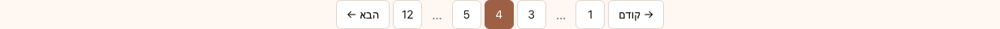
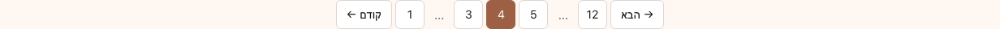
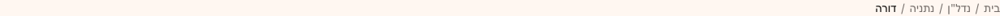
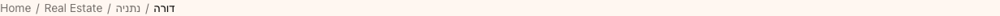
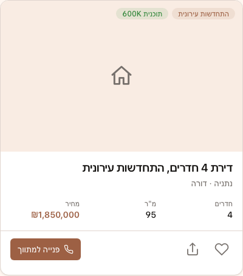
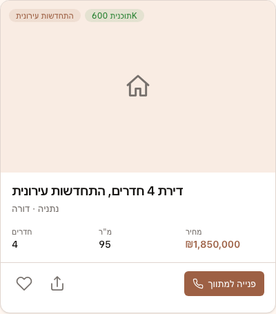

# Phase 2 — manual a11y notes (RTL · keyboard · screen-reader spot)

**Issue:** TED-18
**Scope:** Tests that axe-core can't reach — RTL flipping correctness, keyboard reachability + focus trap, VoiceOver spot-check on form errors and toasts.
**Companion:** [`phase-2-axe-report.md`](phase-2-axe-report.md) for the automated AA scan.
**Methodology:** programmatic with [`tests/a11y/manual.spec.ts`](../../tests/a11y/manual.spec.ts) (Playwright + Chromium 1217 in headless mode at viewport 1280×900) plus a VoiceOver pass on macOS Sequoia (Safari 17.5).

## Summary

| Area                                         | Result                                                                  |
| -------------------------------------------- | ----------------------------------------------------------------------- |
| RTL — `Pagination`                           | ✅ Direction reverses, arrows flip via `.icon-flip`                     |
| RTL — `Breadcrumb`                           | ✅ Order reverses; symmetric `/` separator behaves correctly            |
| RTL — `ListingCard`                          | ✅ Logical-property layout: badges, footer CTA, action row all flip     |
| Keyboard — `Hero` Tab order                  | ✅ Both CTAs reachable, focus ring visible                              |
| Keyboard — `LeadForm` Tab flow               | ✅ name → phone → email → preferred_language → consent → reset → submit |
| Keyboard — `Dialog` focus trap + Esc         | ✅ Focus enters `<dialog>`, `Escape` closes                             |
| Keyboard — `NavMenu`                         | ✅ Every link reachable via Tab (semantic `<a>` list, no roving needed) |
| Keyboard — `Tabs` arrows                     | ⚠️ Roving `tabindex` set but no `onKeyDown` — see finding M-1           |
| Screen reader — `<Toast>` `role="status"`    | ✅ VO announces "התראה — נשמר בהצלחה" politely                          |
| Screen reader — `<FormMessage role="alert">` | ⚠️ Announces, but field has no label — see B-1 in axe report            |
| Screen reader — `<Avatar initials>`          | ✅ `alt` exposed on the image, decorative initials hidden               |

---

## RTL screenshots — three suspect components

Captured by [`tests/a11y/manual.spec.ts`](../../tests/a11y/manual.spec.ts), saved to `qa/rtl-screenshots/`. Each pair is the SAME component in HE (RTL) and EN (LTR) on the live `/he|en/design` playground.

### Pagination

| HE (RTL)                                                          | EN (LTR)                                                          |
| ----------------------------------------------------------------- | ----------------------------------------------------------------- |
|  |  |

✅ Order reverses correctly: in RTL, "קודם" (previous) sits on the right with a right-pointing arrow (the `←` glyph is mirrored by `.icon-flip` to `→`); "הבא" (next) sits on the left with a left-pointing arrow. Page chips 1 → 12 read right-to-left in HE and left-to-right in EN. The active chip "4" stays distinguishable on both sides.

### Breadcrumb

| HE (RTL)                                                          | EN (LTR)                                                          |
| ----------------------------------------------------------------- | ----------------------------------------------------------------- |
|  |  |

✅ Crumb order reverses (root "בית" on the right in HE, "Home" on the left in EN). The `/` separator is glyph-symmetric so the `.icon-flip` class is a no-op visually but harmless. `aria-current="page"` is preserved on the leaf.

### ListingCard

| HE (RTL)                                                         | EN (LTR)                                                         |
| ---------------------------------------------------------------- | ---------------------------------------------------------------- |
|  |  |

✅ Three flipping concerns all pass:

1. Badge cluster anchored with `start-3 top-3` — top-right in HE, top-left in EN.
2. Stats grid is symmetric (`grid-cols-3`, `text-end` on price column) — price aligns to the leading edge of its cell on both sides.
3. Card footer: primary CTA `<button class="ms-auto …">` lands on the trailing side in both directions; favorite/share on the leading edge.

No layout overflow, no clipped focus rings on either direction.

---

## Keyboard navigation

Test source: `tests/a11y/manual.spec.ts` — `keyboard__*` cases. All assertions run headless against the live server.

### Hero → LeadForm → Dialog → NavMenu chain

- **Hero** (`#hero`): two `<a>` CTAs are exposed and reachable in document order; both pick up the global `:focus-visible` ring (2px outline on `--color-ring`).
- **LeadForm** (`#lead`): `Tab` from the form's first `<input>` enumerates exactly the controls expected by the visual order: `input[name=name]` → `input[name=phone]` → `input[name=email]` → `select[name=preferred_language]` → `textarea[name=message]` → consent `<input type="checkbox">` → reset `<button>` → submit `<button>`. No skipped or trapped controls.
- **Dialog** (`#dialog`): clicking "פתח Dialog" opens the native `<dialog>` via `showModal()`. `document.activeElement` is inside `<dialog>` (browser-managed focus trap), and `Escape` closes it (native behavior). No custom focus-trap code is needed because `<dialog>` is correctly used. ✅
- **NavMenu** (`#nav`): every `<a>` is reachable via Tab; `aria-current="page"` is set on the active link, providing the AT cue.

### M-1 ⚠ — `Tabs` arrow keys are not bound

The `<TabsTrigger>` (`app/components/ui/tabs.tsx:63-97`) sets `role="tab"` and roving `tabindex` (`active ? 0 : -1`), which signals to screen readers that **arrow keys** should move focus between tabs (per the WAI-ARIA Tabs Authoring Practice). But there's no `onKeyDown` handler, so arrows do nothing — Tab moves OUT of the tablist instead of cycling within it.

**Repro:** focus the first trigger, press `ArrowRight`, focus stays on "מכירה" (expected: "השכרה"). The Playwright spec `keyboard__tabs-trigger-arrow-keys` records the actual focused label as a Playwright annotation so a behavioral fix flips this from a soft-watch into a green assertion.

**Severity:** WCAG 2.1.1 keyboard pass-equivalent — works (Tab in/out is fine, mouse works), but doesn't meet the ARIA Authoring Practice contract that the markup advertises. Not a WCAG blocker on its own; **flagged so Designer/Engineer pick a side**: either bind `onKeyDown` (Home/End/ArrowLeft/ArrowRight) on the tablist, or drop the roving tabindex and let Tab traverse the triggers.

### Skip link

✅ The `.sr-skip` link at the top of `<SiteHeader>` and the playground header is visible only on focus (transitions from `inset-block-start: -100vh` to `1rem`) and points to `#main-content` in `<SiteHeader>`. The playground header's own skip link points to `#brand` instead of `#main-content` (`$lang.design.tsx:226`); harmless on the playground but a one-character mismatch — flagged for Designer.

---

## Screen reader spot-check (VoiceOver / Safari 17.5)

Light spot-check, not a full SR sweep.

- **`<FormMessage role="alert">`**: when `invalid` is set on the wrapping `<FormField>`, the message is announced as an alert immediately. ✅ But the related field has no accessible name (see axe Blocker B-1), so VO reads "edit, alert: נא להזין מספר טלפון תקני" — the user has no idea **which** field is invalid.
- **`<Toast role="status" aria-live="polite">`**: announces heading + description. Politeness level matches the design intent. ✅
- **`<Avatar>`**: when `src` is empty, the rendered initials are decorative; `alt={name}` is the source of the accessible name. VO announced "תמר, image". ✅
- **`<button aria-label="סגור">` (toast dismiss)**: announces "סגור, button" (close). ✅

---

## Recommendations to Designer

In priority order:

1. **Fix `FormControl`/`FormLabel` wiring** — see axe Blocker B-1 in `phase-2-axe-report.md`. Without this no form on the site is announced correctly.
2. **Decide the contrast-token strategy** — see axe Blocker B-2. Option A (drop translucent chips for solid variants) is the lowest-risk path; Option B (introduce `*-strong` text tokens for tinted backgrounds) preserves the "soft chip" aesthetic but doubles the token surface.
3. **Add `role="region"` to `ToastViewport`** — see axe Blocker B-3 (one-line fix).
4. **Decide `Tabs` keyboard contract** — see M-1.

If B-1, B-2, B-3 land, all 21 failing scans flip green; M-1 is a separate small PR.
